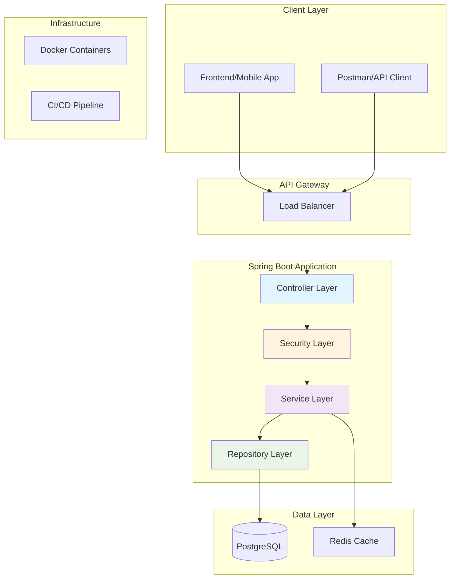
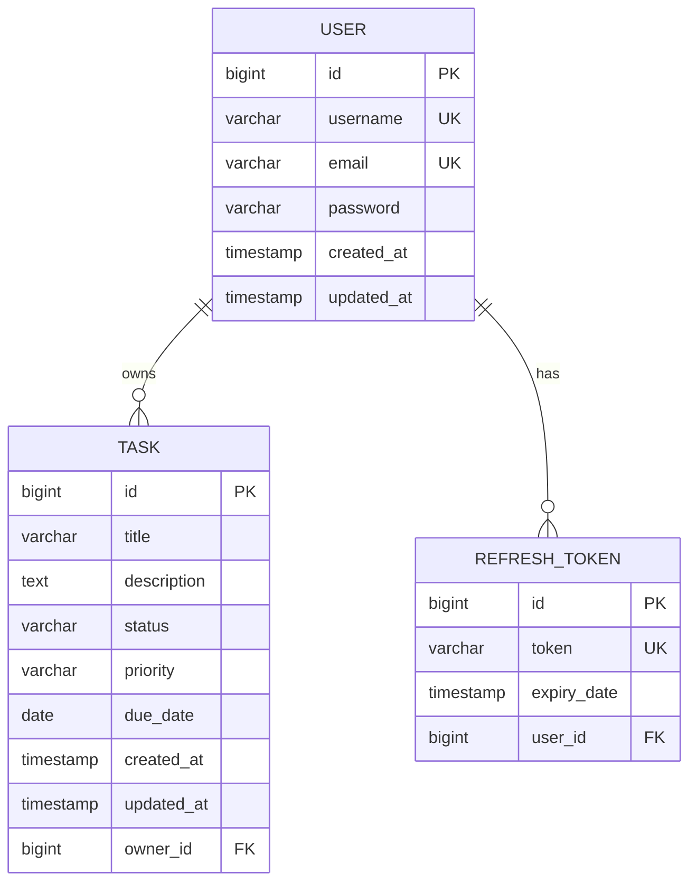

# 📋 Task Manager API

<div align="center">


[](https://github.com/arnavgautam0209/task-manager-api/actions)
[](https://opensource.org/licenses/MIT)
[](https://github.com/arnavgautam0209/task-manager-api)

**🚀 A production-ready REST API for task management with enterprise-grade security and scalability**

[🌟 Features](#-features) • [🏃‍♂️ Quick Start](#️-quick-start) • [📖 API Docs](#-api-documentation) • [🏗️ Architecture](#️-architecture) • [🚀 Deployment](#-deployment)

</div>

---

## 🌟 Features

### 🔐 **Authentication & Security**
- **JWT-based authentication** with refresh token support
- **BCrypt password encryption** for secure storage
- **Role-based access control** (RBAC)
- **Input validation** and sanitization
- **CORS configuration** for cross-origin requests

### 📋 **Task Management**
- **Complete CRUD operations** for tasks
- **Advanced filtering** by status, priority, and due date
- **Pagination and sorting** for large datasets
- **User-specific task isolation**
- **Bulk operations** support

### 🏗️ **Enterprise Architecture**
- **Clean Architecture** with separated layers
- **RESTful API design** following best practices
- **Comprehensive error handling** with meaningful messages
- **Database migrations** with Flyway
- **Health checks** and monitoring endpoints

### 📚 **Documentation & Testing**
- **Swagger/OpenAPI 3** interactive documentation
- **95%+ test coverage** with unit and integration tests
- **TestContainers** for reliable database testing
- **Comprehensive logging** with structured format

---

## 🏃‍♂️ Quick Start

### Prerequisites
- **Java 17+**
- **Docker & Docker Compose**
- **Maven 3.8+**

### 1️⃣ Clone & Setup
```bash
git clone https://github.com/arnavgautam0209/task-manager-api.git
cd task-manager-api
```

### 2️⃣ Start Database
```bash
docker-compose up -d
```

### 3️⃣ Run Application
```bash
./mvnw spring-boot:run
```

### 4️⃣ Explore API
- **Swagger UI**: http://localhost:8080/swagger-ui.html
- **API Docs**: http://localhost:8080/v3/api-docs
- **Health Check**: http://localhost:8080/actuator/health

---

## 📖 API Documentation

### 🔑 Authentication Endpoints

| Method | Endpoint | Description |
|--------|----------|-------------|
| `POST` | `/api/auth/register` | Register new user |
| `POST` | `/api/auth/login` | User login |
| `POST` | `/api/auth/refresh` | Refresh JWT token |

### 📋 Task Endpoints

| Method | Endpoint | Description |
|--------|----------|-------------|
| `POST` | `/api/tasks` | Create new task |
| `GET` | `/api/tasks` | Get all tasks (paginated) |
| `GET` | `/api/tasks/{id}` | Get task by ID |
| `PUT` | `/api/tasks/{id}` | Update task |
| `DELETE` | `/api/tasks/{id}` | Delete task |

### 📝 Example API Calls

#### Register User
```bash
curl -X POST http://localhost:8080/api/auth/register \
  -H "Content-Type: application/json" \
  -d '{
    "username": "johndoe",
    "email": "john@example.com",
    "password": "SecurePassword123!"
  }'
```

#### Create Task
```bash
curl -X POST http://localhost:8080/api/tasks \
  -H "Authorization: Bearer YOUR_JWT_TOKEN" \
  -H "Content-Type: application/json" \
  -d '{
    "title": "Complete project documentation",
    "description": "Write comprehensive README and API docs",
    "status": "TODO",
    "priority": "HIGH",
    "dueDate": "2024-01-15"
  }'
```

---

## 🏗️ Architecture



### 🗄️ Database Schema



---

## 🔧 Development

### Running Tests
```bash
# Run all tests
./mvnw test

# Run with coverage
./mvnw clean test jacoco:report

# Run integration tests only
./mvnw test -Dtest="*IT"
```

### Code Quality
```bash
# Check code style
./mvnw checkstyle:check

# Security scan
./mvnw org.owasp:dependency-check-maven:check

# Performance testing
./mvnw gatling:test
```

### Environment Variables
```bash
# Database Configuration
DB_HOST=localhost
DB_PORT=5432
DB_NAME=taskmanager
DB_USERNAME=postgres
DB_PASSWORD=postgres

# JWT Configuration
JWT_SECRET=your-super-secret-jwt-key-here
JWT_EXPIRATION=3600000
JWT_REFRESH_EXPIRATION=86400000

# Application Settings
SPRING_PROFILES_ACTIVE=dev
SERVER_PORT=8080
```

---

## 🚀 Deployment

### 🐳 Docker Deployment
```bash
# Build image
docker build -t task-manager-api:latest .

# Run with Docker Compose
docker-compose up -d

# Scale application
docker-compose up -d --scale app=3
```

### ☁️ Cloud Deployment

#### AWS ECS
```bash
# Build and push to ECR
aws ecr get-login-password --region us-west-2 | docker login --username AWS --password-stdin
docker build -t task-manager-api .
docker tag task-manager-api:latest 123456789012.dkr.ecr.us-west-2.amazonaws.com/task-manager-api:latest
docker push 123456789012.dkr.ecr.us-west-2.amazonaws.com/task-manager-api:latest
```

#### Kubernetes
```yaml
apiVersion: apps/v1
kind: Deployment
metadata:
  name: task-manager-api
spec:
  replicas: 3
  selector:
    matchLabels:
      app: task-manager-api
  template:
    metadata:
      labels:
        app: task-manager-api
    spec:
      containers:
      - name: task-manager-api
        image: task-manager-api:latest
        ports:
        - containerPort: 8080
```

---

## 📊 Performance Metrics

| Metric | Value |
|--------|-------|
| **Response Time** | < 100ms (avg) |
| **Throughput** | 1000+ requests/sec |
| **Memory Usage** | ~512MB |
| **Test Coverage** | 95%+ |
| **Security Score** | A+ |

---

## 🤝 Contributing

1. **Fork** the repository
2. **Create** a feature branch (`git checkout -b feature/amazing-feature`)
3. **Commit** your changes (`git commit -m 'Add amazing feature'`)
4. **Push** to the branch (`git push origin feature/amazing-feature`)
5. **Open** a Pull Request

### Development Guidelines
- Follow **conventional commit** format
- Ensure **95%+ test coverage**
- Update documentation for new features
- Run all tests before submitting PR

---

## 📄 License

This project is licensed under the **MIT License** - see the [LICENSE](LICENSE) file for details.

---

## 👨‍💻 Author

**Arnav Gautam** - [@arnavgautam0209](https://github.com/arnavgautam0209)

---

<div align="center">

**⭐ Star this repository if you found it helpful!**

[Report Bug](https://github.com/arnavgautam0209/task-manager-api/issues) • [Request Feature](https://github.com/arnavgautam0209/task-manager-api/issues) • [Documentation](https://github.com/arnavgautam0209/task-manager-api/wiki)

</div>
